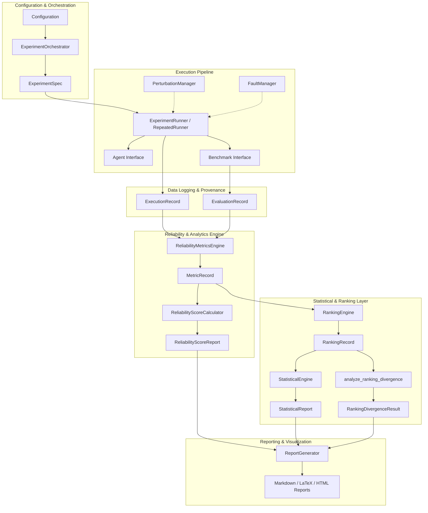

# Architecture Documentation — LLM Reliability Ranking Framework

## Executive Overview

The **LLM Reliability Ranking Framework** is a research-grade infrastructure for evaluating and comparing Large Language Model (LLM) agents across three fundamental reliability dimensions:

1. **Repeated-Run Consistency**: Stability of agent behavior and responses across identical executions under identical conditions.
2. **Prompt Perturbation Robustness**: Resilience of agent performance under semantically invariant prompt modifications (e.g., typos, rephrasing, formatting variations).
3. **Fault Tolerance**: Agent survivability and operational continuity when subjected to injected environment and API faults (e.g., transient network errors, latency spikes, context truncations).

The framework decouples benchmark definitions, agent runtimes, perturbation generation, fault injection, record logging, metrics computation, statistical analysis, and report generation into clean, modular layers.

---

## Architectural Principles & Design Patterns

The architecture adheres strictly to clean software engineering and research reproducibility principles:

- **Immutable Value Objects & Records**: All execution, evaluation, metric, and ranking data are represented as immutable Pydantic models (`ExecutionRecord`, `EvaluationRecord`, `MetricRecord`, `RankingRecord`).
- **Deterministic Hashing & Provenance**: Every experiment run records a SHA-256 configuration hash computed over canonical JSON configurations, tracking exact prompt versions, seeds, dataset versions, and framework versions.
- **Strict Interfaces (Liskov Substitution)**: `Agent` and `Benchmark` abstract base classes establish firm contracts. Adapters (e.g., `SWEbenchLiteAdapter`, `AgentBoardAdapter`, `GAIAAdapter`) wrap external benchmarks without altering core framework code.
- **Extensible Plugin Registry**: Standardized registries (`BenchmarkRegistry`, `AgentRegistry`, `PerturbationRegistry`, `FaultRegistry`, `MetricRegistry`) support dynamic component discovery and runtime configuration.
- **Fail-Safe Metrics Aggregation**: `ReliabilityScoreCalculator` dynamically redistributes weights when specific reliability dimensions are unmeasured, preventing missing data from corrupting composite scores.

---

## High-Level Architecture Diagram



---

## Key Modules & Package Structure

```
src/llm_reliability/
├── agents/             # Agent interface, mock agents, LLM providers & adapters
├── benchmarks/         # Benchmark interface, mock benchmark, benchmark adapters
├── configs/            # Pydantic configuration schemas & validation
├── experiments/        # Experiment runners & execution controllers
├── interfaces/         # Standard base contracts (Agent, Benchmark)
├── metrics/            # Base metric contracts & metric computation engine
├── orchestration/      # Experiment orchestrator & spec generators
├── pipeline/           # End-to-end pipeline execution controllers
├── ranking/            # Success, reliability, & weighted rankers
├── records/            # Immutable data records (Execution, Evaluation, Metric, Ranking)
├── reliability/        # Consistency, robustness, fault tolerance engines & score calculator
├── reporting/          # Summary generation & multi-format export (Markdown/LaTeX/HTML)
├── reproducibility/    # Seed management, system info tracking, & archive building
├── statistics/         # Spearman/Kendall correlations, hypothesis tests, ranking divergence
├── utils/              # Serialization, hashing, context managers, logging
└── visualization/      # Plotters (distributions, correlations, rankings)
```

---

## Provenance & Data Flow

1. **Configuration Stage**: `Configuration` is initialized with benchmark parameters, agent settings, random seed, perturbation configurations, fault injection flags, and optional reliability dimension weights. A 64-character SHA-256 hash is computed.
2. **Execution Stage**: `ExperimentRunner` or `RepeatedRunner` executes the agent against benchmark tasks, optionally wrapping executions with prompt perturbations (`PerturbationManager`) or failure injections (`FaultManager`). Output data is captured as `ExecutionRecord`.
3. **Evaluation Stage**: Benchmark evaluators inspect agent outputs to determine task success/score, creating immutable `EvaluationRecord` instances linked to the execution hash.
4. **Reliability Analysis Stage**: `ReliabilityMetricsEngine` calculates dimension-specific metrics (consistency, robustness, fault tolerance) and synthesizes `MetricRecord` instances. `ReliabilityScoreCalculator` derives composite reliability scores.
5. **Ranking & Statistical Analysis**: `RankingEngine` constructs success and reliability rankings. `StatisticalEngine` performs Spearman rank correlation, Kendall Tau concordance tests, and bootstrap confidence interval estimations. `analyze_ranking_divergence` computes ranking overlap, divergence, and rank displacement.
6. **Reporting Stage**: `ReportGenerator` compiles structured metrics, statistical outputs, and divergence insights into publication-ready Markdown, LaTeX, and HTML reports.

---

## Statistical & Reproducibility Guarantees

- **Random Seed Isolation**: `SeedManager` sets exact seeds across `random`, `numpy`, and `torch` (where installed), restoring initial RNG states upon exit.
- **Ranking Divergence Quantification**: Quantifies discordance between traditional success rate rankings ($R_{succ}$) and multi-dimensional reliability rankings ($R_{rel}$) using normalized pair concordance:
  $$\text{Overlap}(R_1, R_2) = \frac{C + 0.5 T}{\binom{n}{2}}, \quad \text{Divergence} = 1 - \text{Overlap}$$
- **Weight Redistribution**: When prompt perturbation or fault tolerance data is absent for an experiment, the composite reliability calculator automatically redistributes missing dimension weights proportionally across available dimensions:
  $$w'_i = \frac{w_i}{\sum_{j \in \mathcal{A}} w_j}$$
