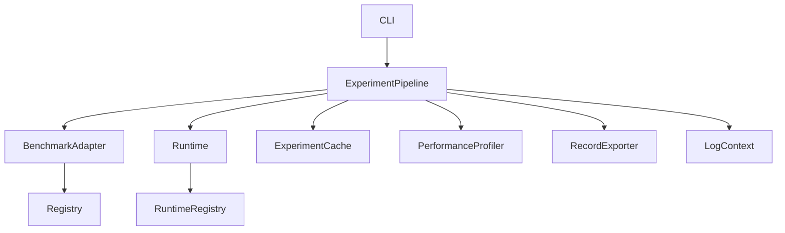

# Architecture

## Overview

The LLM Reliability Ranking Framework is organized as a pipeline of modular components connected through well-defined interfaces.

## Component Descriptions

### CLI
Command-line entry point (`llm-reliability`). Parses subcommands (`run`, `list`, `validate`, `clear-cache`) and delegates to the appropriate handler. Defined in `src/llm_reliability/cli.py`.

### ExperimentPipeline
Core orchestration class that drives a single (benchmark, agent, seed) execution. Loads tasks, runs each through the agent, evaluates outputs, computes metrics, and generates rankings. Handles model initialization failures and memory-constrained fast-skip logic.

### BenchmarkAdapter
Abstract benchmark interface (`Benchmark`) implemented by all adapters (GAIA, AgentBoard, SWE-Bench Lite, Mock, ARC, GSM8K, MMLU, etc.). Each adapter owns task loading, agent invocation, and evaluation logic. Base class: `BaseBenchmarkAdapter`.

### Runtime
Agent runtime interface (`Runtime`) for LLM inference backends. Implementations include Ollama, OpenAI, Anthropic, Gemini, DeepSeek, Qwen, Hugging Face, vLLM, and llama.cpp.

### ExperimentCache
Result caching layer backed by `FileSystemCacheBackend`. Generates SHA-256 cache keys from configuration and returns cached `ExperimentResult` objects on repeated identical executions.

### PerformanceProfiler
Lightweight in-process profiler tracking total experiment duration, per-benchmark/per-model timings, and cache hit/miss counts. No external profiling tools required.

### RecordExporter
Stateless exporter that serializes `ExecutionRecord`, `EvaluationRecord`, `MetricRecord`, and `RankingRecord` lists to CSV via pandas DataFrames.

### LogContext
Thread-local structured logging context using `contextvars`. Adds metadata fields (experiment ID, benchmark name, agent name) to all log records within a context scope.

### Registry (`BenchmarkRegistry`)
Plugin-based registry for benchmark adapters. Supports direct registration, decorator-based registration, and automatic package discovery. Safe to call multiple times — recovers registrations after test fixture teardown.

### RuntimeRegistry
Plugin-based registry for runtime implementations. Mirrors `BenchmarkRegistry` pattern with auto-discovery and decorator support. Enables third-party runtimes without editing framework core files.
